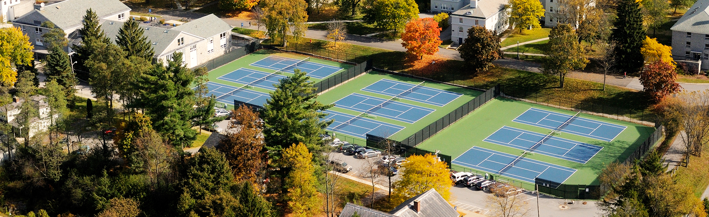

Welcome to my web page for the Reproducible Biology in R course during J-Term 2023. I am a Molecular Biology and Biochemistry Major at Middlebury College. This is where I will post all of my assignments throughout the course.

## Daily Assignments
[Assignment 1](Assignment_1.html)  
[Assignment 2](Assignment_2.html)  
[Assignment 3](Assignment_3.html)  
[Assignment 4](Assignment_4.html)  
[Assignment 5](Assignment_5.html)  
[Assignment 6](Assignment_6.html)  

## Weekly Assignments
[Weekly Assignment 1](Weekly_Assignment_1.html)  
[Weekly Assignment 2](Weekly_Assignment_2.html)  

